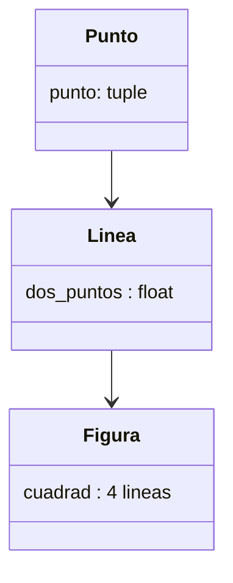

# Ejercicio 4
## reto 4
En este ejercicio podemos observar la implementación de composición, de hherencia, de polimorfismo y de encapsulamiento.
el objetivo es una mega clase que le de a las clases hijas diferentes datos y atributos, de los cuales le permita conocer el area, el perimetro, los vertices, las aristas y los angulos internos. 
pero primero creamos la clase padre donde estara gran parte de todo el codigo.
```python

class Point ():
    def __init__(self,x_y):
        self.x, self.y = x_y
    def punto_(self):
        self.xy = self.x, self.y
        return self.xy


class Linea():

    def __init__ ( self, punto_inicial: tuple ,  punto_final: tuple ):
        self.punto1 = Point(punto_inicial)
        self.punto  = Point(punto_final)
        self.p1  = self.punto1.punto_()
        self.p0 = self.punto.punto_()
        self.distance = float(((self.punto.x - self.punto1.x )**2+(self.punto.y - self.punto1.y )**2)**0.5)
    def distancia(self):
        return self.distance


class Shape():
    regular: bool 
    def __init__(self):
        pass
    def calcular_area(self ):
        pass
    def vertices(self, lista : "Point"):
        pass
    def aristas(self, lista : "Linea"):
        pass
    def angulos_interiores (self ):
        pass
    def calcular_perimetro(self):
        pass
```
Para la creación de este mismo me base en crear las figuras desde lo mas pequeño hasta lo mas grande, osea use composición para que el usuario me ingresara los vertices (puntos) y yo pueda unir esos puntosen un orden especcifico de tal manera que me quede la figura deseada y asi poder usar los diferentes metodos que se quieren tener, como el area o el perimetro etc.
Para darse una idea es algo asi :


Usamos composición para la creación de las figuras y luego tener los datos necesarios para las operaciones realizadas: 
Esta seria la clase que usariamos para la realización de rectangulo:
```python
class Rectangulo (Shape):
    regular: bool = False
    def __init__ ( self, p1: tuple ,  p2: tuple, p3: tuple, p4:tuple):
        self.p1 =p1
        self.p2 =p2
        self.p3 =p3
        self.p4 =p4
        self.linea1 = Linea(p1,p2)
        self.L1 = self.linea1.distancia()
        self.linea2 = Linea(p2,p3)
        self.L2 = self.linea2.distancia()
        self.linea3 = Linea(p3,p4)
        self.L3 = self.linea3.distancia()
        self.linea4 = Linea(p4,p1)
        self.L4 = self.linea4.distancia()
        if self.L1 == self.L3 and self.L2 ==self.L4:
            print (f"sus lados son  {self.L1, self.L2,self.L3,self.L4}")
        else:
            return "no es un rectangulo, por favor organiza los datos de una forma correcta"

    def calcular_perimetro(self):
        if self.L1 == self.L3 and self.L2 ==self.L4:
            return f"Su perimetro es {(self.L1 + self.L2 )*2} unidades"
        else :
            return "no es un rectangulo"
    def calculara_area(self):
        if self.L1 == self.L3 and self.L2 ==self.L4:
            return f"Su area son {(self.L1 * self.L2 )} unidades"
        else :
            return "no es un rectangulo, por favor organiza los datos de una forma correcta"      
    def vertices( self):
        if self.L1 == self.L3 and self.L2 ==self.L4:
            return f"Sus vertices son los puntos: \nPunto 1: {self.L1} \nPunto 2: {self.L2} "\
                f"\nPunto 3: { self.L3} \nPunto 4: {self.L4}\nlista={[self.L1,self.L2,self.L3,self.L4]}"
        else :
            return "no es un rectangulo, por favor organiza los datos de una forma correcta"
    def aristas(self):
        if self.L1 == self.L3 and self.L2 ==self.L4:
            return f"Sus aristas son las lineas:\nLinea 1: {self.L1} unidades\nLinea 2: {self.L2} unidades"\
                   f"\nLinea 3: {self.L3} unidades\nLinea 4: { self.L4} unidades"\
                   f"\nlista={[self.L1,self.L2,self.L3,self.L4]}"
        else :
            return "no es un rectangulo, por favor organiza los datos de una forma correcta"
        
    def ang_inter(self):
        if self.L1 == self.L3 and self.L2 ==self.L4:
            return "es un rectangulo , por lo tanto todos sus angulos interiores miden " \
                    "90°  por vertice"
        else :
            return "no es un rectangulo, por favor organiza los datos de una forma correcta"

```
La de triangulo seria asi
```python
import math
class Triangulo(Shape):
    regular: bool = True
    def __init__ ( self, p1: tuple ,  p2: tuple, p3: tuple):
        self.p1 =p1
        self.p2 =p2
        self.p3 =p3

        self.linea1 = Linea(p1,p2)
        self.L1 = self.linea1.distancia()
        self.linea2 = Linea(p2,p3)
        self.L2 = self.linea2.distancia()
        self.linea3 = Linea(p3,p1)
        self.L3 = self.linea3.distancia()

        self.perimetro = (self.L1 + self.L2 + self.L3)
        self.perimetro_2 = self.perimetro /2
        self.area = ((self.perimetro_2)*(self.perimetro_2-self.L1)*\
                     (self.perimetro_2-self.L2)*(self.perimetro_2-self.L3))**0.5
        
        inter_L3 = math.acos((self.L1**2 + self.L2**2 - self.L3**2 )\
                                            /(self.L1*self.L2*2))
        inter_L2 = math.acos((self.L3**2 + self.L1**2 - self.L2**2 )\
                                            /(self.L1*self.L3*2))
        inter_L1 = math.acos((self.L3**2 + self.L2**2 - self.L1**2 )\
                                            /(self.L3*self.L2*2))
        self.inter_L1 = inter_L1 *180 / 3.14159265358979323846264
        self.inter_L2 = inter_L2 *180 / 3.14159265358979323846264
        self.inter_L3 = inter_L3 *180 / 3.14159265358979323846264


    def calcular_perimetro(self):
        if self.area == 0:
            return "...¡¿algo salio mal?! ordena mejor los datos"
        
        return f"El perimetro del triangulo es {self.perimetro}"

    def calcular_area(self):
        if self.area == 0:
            return "...¡¿algo salio mal?! ordena mejor los datos"
        
        return f"El area del triangulo es {self.area}"
    
    def aristas(self):
        if self.area == 0:
            return "...¡¿algo salio mal?! ordena mejor los datos"
        
        return f"Las aristas del triangulo son \n{self.L1}\n{self.L2}\n{self.L3}"\
                f"\nlista={[self.L1,self.L2,self.L3]}"

    def vertices(self):
        if self.area == 0:
            return "...¡¿algo salio mal?! ordena mejor los datos"
        
        return f"Los vertices del triangulo son \n{self.p1} \n{self.p2} \n{self.p3}"\
                f"\nlista={[self.L1,self.L2,self.L3]}"
    
    def ang_inter(self):
        if self.area == 0:
            return "...¡¿algo salio mal?! ordena mejor los datos"
        else:
           return f"Aproximadamente los angulos internos son: \n{self.inter_L1}°\n{self.inter_L2}°\n{self.inter_L3}°"
     ```
en esta importamos math ya que se necesitara para la solucion de los metods, aquí pasa algo malo, y es que como son numeros tan grandes y extensos no pude llegar a un numero preciso, del cual afecta indirectamente a triangulos como el equilatero, ya que nunca existira uno por decimas ( osea sus lados difieren un poco aunque sean iguales).
en general este es tan practico, que para todos los triangulos ya que permite que cualquier triangulo lo pueda usar y maneje sus metodos, además de no necesitar de un orden especifico para la creación de la figura.

Ya como ultimo seria el codigo en general, que dando un resumen seria algo así.
## resumen
la mega clase hereda a las clases menores lo "escencial" lo que se debe tener (por asi decirlo), las clases hijas se dividiran en dos, aqui el usuario ingresa 3 vertices para crear un triangulo y asi mostrar lo que la clase padre le diga que muestre, y para el rectangulo se ingresa los 4 vertices en un orden de tal manera pueda crearse el rectangulo sin  problema. ambas por medio del vertice nace los lados que a su vez salen los datos, como altura, base etc.
En general este es el codigo grande:
import math
  ```python
class Point ():
    def __init__(self,x_y):
        self.x, self.y = x_y
    def punto_(self):
        self.xy = self.x, self.y
        return self.xy


class Linea():

    def __init__ ( self, punto_inicial: tuple ,  punto_final: tuple ):
        self.punto1 = Point(punto_inicial)
        self.punto  = Point(punto_final)
        self.p1  = self.punto1.punto_()
        self.p0 = self.punto.punto_()
        self.distance = float(((self.punto.x - self.punto1.x )**2+(self.punto.y - self.punto1.y )**2)**0.5)
    

    def distancia(self):
        return self.distance


class Shape():
    regular: bool 
    def __init__(self):
        pass

    
    def calcular_area(self ):
        pass

    def vertices(self, lista : "Point"):
        pass


    def aristas(self, lista : "Linea"):
        pass


    def angulos_interiores (self ):
        pass
     

    def calcular_perimetro(self):
        pass


class Rectangulo (Shape):
    regular: bool = False
    def __init__ ( self, p1: tuple ,  p2: tuple, p3: tuple, p4:tuple):
        self.p1 =p1
        self.p2 =p2
        self.p3 =p3
        self.p4 =p4

        self.linea1 = Linea(p1,p2)
        self.L1 = self.linea1.distancia()
        self.linea2 = Linea(p2,p3)
        self.L2 = self.linea2.distancia()
        self.linea3 = Linea(p3,p4)
        self.L3 = self.linea3.distancia()
        self.linea4 = Linea(p4,p1)
        self.L4 = self.linea4.distancia()

        if self.L1 == self.L3 and self.L2 ==self.L4:
            print (f"sus lados son  {self.L1, self.L2,self.L3,self.L4}")
        else:
            return "no es un rectangulo, por favor organiza los datos de una forma correcta"
    

    def calcular_perimetro(self):
        if self.L1 == self.L3 and self.L2 ==self.L4:
            return f"Su perimetro es {(self.L1 + self.L2 )*2} unidades"
        else :
            return "no es un rectangulo"
    

    def calculara_area(self):
        if self.L1 == self.L3 and self.L2 ==self.L4:
            return f"Su area son {(self.L1 * self.L2 )} unidades"
        else :
            return "no es un rectangulo, por favor organiza los datos de una forma correcta"      
    

    def vertices( self):
        if self.L1 == self.L3 and self.L2 ==self.L4:
            return f"Sus vertices son los puntos: \nPunto 1: {self.L1} \nPunto 2: {self.L2} "\
                f"\nPunto 3: { self.L3} \nPunto 4: {self.L4}\nlista={[self.L1,self.L2,self.L3,self.L4]}"
        else :
            return "no es un rectangulo, por favor organiza los datos de una forma correcta"
        

    def aristas(self):
        if self.L1 == self.L3 and self.L2 ==self.L4:
            return f"Sus aristas son las lineas:\nLinea 1: {self.L1} unidades\nLinea 2: {self.L2} unidades"\
                   f"\nLinea 3: {self.L3} unidades\nLinea 4: { self.L4} unidades"\
                   f"\nlista={[self.L1,self.L2,self.L3,self.L4]}"
        else :
            return "no es un rectangulo, por favor organiza los datos de una forma correcta"
        
    def ang_inter(self):
        if self.L1 == self.L3 and self.L2 ==self.L4:
            return "es un rectangulo , por lo tanto todos sus angulos interiores miden " \
                    "90°  por vertice"
        else :
            return "no es un rectangulo, por favor organiza los datos de una forma correcta"    

class Cuadrado (Rectangulo):
    regular: bool = True
    def __init__ ( self, p1: tuple ,  p2: tuple, p3: tuple, p4:tuple):

        self.linea1 = Linea(p1,p2)
        Li1 = self.linea1.distancia()
        self.linea2 = Linea(p2,p3)
        Li2 = self.linea2.distancia()
        self.linea3 = Linea(p3,p4)
        Li3 = self.linea3.distancia()
        self.linea4 = Linea(p4,p1)
        Li4 = self.linea4.distancia()
        if Li1==Li2 and Li3 ==Li4:
            if Li1==Li3 and Li2 ==Li4:
                super().__init__(p1,p2,p3,p4)
            else:
                print ("No es un Cuadrado, Organiza mejor los vertices")
        else:
            print ("No es un Cuadrado, Organiza mejor los vertices")
        
    def ang_inter(self):
        if self.L1 == self.L3 and self.L2 ==self.L4:
            if self.L2== self.L4 and self.L1 ==self.L4:
                return f"es un cuadrado , por lo tanto todos sus angulos interiores miden " \
                   f"90°  por vertice" 
            return "no es un cuadrado"
        else :
            return "no es un cuadrado "  


class Triangulo(Shape):
    regular: bool = True
    def __init__ ( self, p1: tuple ,  p2: tuple, p3: tuple):
        self.p1 =p1
        self.p2 =p2
        self.p3 =p3

        self.linea1 = Linea(p1,p2)
        self.L1 = self.linea1.distancia()
        self.linea2 = Linea(p2,p3)
        self.L2 = self.linea2.distancia()
        self.linea3 = Linea(p3,p1)
        self.L3 = self.linea3.distancia()

        self.perimetro = (self.L1 + self.L2 + self.L3)
        self.perimetro_2 = self.perimetro /2
        self.area = ((self.perimetro_2)*(self.perimetro_2-self.L1)*\
                     (self.perimetro_2-self.L2)*(self.perimetro_2-self.L3))**0.5
        
        inter_L3 = math.acos((self.L1**2 + self.L2**2 - self.L3**2 )\
                                            /(self.L1*self.L2*2))
        inter_L2 = math.acos((self.L3**2 + self.L1**2 - self.L2**2 )\
                                            /(self.L1*self.L3*2))
        inter_L1 = math.acos((self.L3**2 + self.L2**2 - self.L1**2 )\
                                            /(self.L3*self.L2*2))
        self.inter_L1 = inter_L1 *180 / 3.14159265358979323846264
        self.inter_L2 = inter_L2 *180 / 3.14159265358979323846264
        self.inter_L3 = inter_L3 *180 / 3.14159265358979323846264


    def calcular_perimetro(self):
        if self.area == 0:
            return "...¡¿algo salio mal?! ordena mejor los datos"
        
        return f"El perimetro del triangulo es {self.perimetro}"

    def calcular_area(self):
        if self.area == 0:
            return "...¡¿algo salio mal?! ordena mejor los datos"
        
        return f"El area del triangulo es {self.area}"
    
    def aristas(self):
        if self.area == 0:
            return "...¡¿algo salio mal?! ordena mejor los datos"
        
        return f"Las aristas del triangulo son \n{self.L1}\n{self.L2}\n{self.L3}"\
                f"\nlista={[self.L1,self.L2,self.L3]}"

    def vertices(self):
        if self.area == 0:
            return "...¡¿algo salio mal?! ordena mejor los datos"
        
        return f"Los vertices del triangulo son \n{self.p1} \n{self.p2} \n{self.p3}"\
                f"\nlista={[self.L1,self.L2,self.L3]}"
    
    def ang_inter(self):
        if self.area == 0:
            return "...¡¿algo salio mal?! ordena mejor los datos"
        else:
           return f"Aproximadamente los angulos internos son: \n{self.inter_L1}°\n{self.inter_L2}°\n{self.inter_L3}°"
           

class   Isosceles(Triangulo):
    def __init__ ( self, p1: tuple ,  p2: tuple, p3: tuple):
        
         super().__init__(p1,p2,p3)


class Equilateral(Triangulo):
    pass


class Scalene(Triangulo):
    pass


class TriRectangle(Triangulo):
    pass


figura3 = Isosceles ((0,0),(6,0),(3,5))
carro= Rectangulo((2,0),(0,0),(0,3),(2,3))    
moto = Cuadrado((2,0),(0,0),(0,2),(2,2))
print (carro.aristas())
print (carro.vertices())
print (carro.calculara_area())
print (carro.calcular_perimetro())
print (carro.ang_inter())

print (moto.aristas())
print (moto.vertices())
print (moto.calculara_area())
print (moto.calcular_perimetro())
print (moto.ang_inter())

print(f"{figura3.calcular_area()} y {figura3.calcular_perimetro()}")
print (figura3.vertices())
print (figura3.aristas())
print (figura3.ang_inter())
  ```
posdata, deje unos ejercicios de los cuales corren bastante bien.


##Reto_4 b
